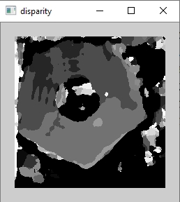

# depthmap
depthmap using census transform and hamming distance

https://www.youtube.com/watch?v=Lx64IZDGEHI&feature=youtu.be

# Example
  

# Papers
- [Stereo Matching using Census Transform of Adaptive Window Sizes with Gradient Images](http://www.apsipa.org/proceedings_2016/HTML/paper2016/277.pdf)
- [Depth Map Estimation Using Census Transform for Light FieldCameras](https://www.jstage.jst.go.jp/article/transinf/E100.D/11/E100.D_2017EDP7052/_pdf)
- [NonparametricLocalTransformsforComputingVisualCorrespondence](http://www.cs.cornell.edu/~rdz/Papers/ZW-ECCV94.pdf)
- [Stereoscopic Depth Sensing – A Python Approach](https://aikiddie.wordpress.com/2017/05/24/depth-sensing-stereo-image/)
